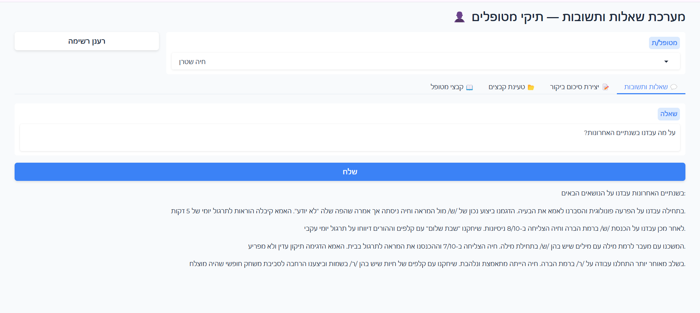
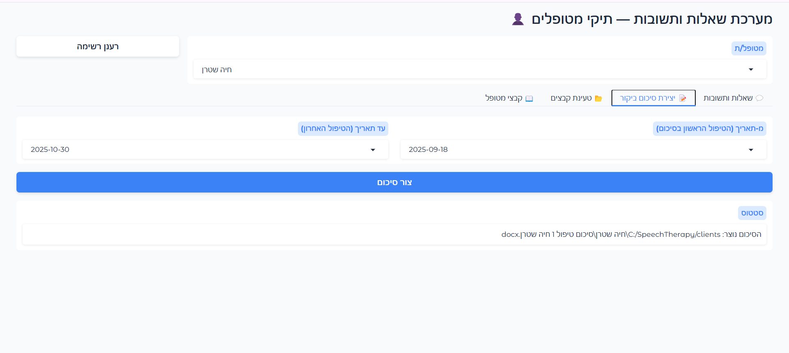

# Clinical RAG — Patient Q&A System


A retrieval-augmented generation system for a speech-language pathology clinic. The system allows the clinician to ask natural-language questions in Hebrew about patient records and receive grounded answers drawn directly from the patient files.

## Why I built this

A speech-language clinic I work with was managing patient records as a folder of `.docx` files per patient — diagnosis reports, visit summaries, treatment plans — searched by hand whenever a clinician needed to answer a question like "what treatment approach did we agree on in March?" or "which sessions covered articulation exercises?". I built this as a real tool for that clinic: a Hebrew-language Q&A system that retrieves and grounds its answers strictly in the patient's own documents, with a hard requirement that no real patient data ever leaves the local machine in identifiable form — everything is de-identified before indexing and re-identified only when displaying the final answer back to the clinician.

## Purpose

Patient data is stored as `.docx` files organized in a folder per patient. The system ingests those files, de-identifies them, stores structured metadata in a local SQLite database, and indexes treatment-plan content in Pinecone for semantic search. Queries are answered by Claude Haiku 4.5, strictly from retrieved context.

Supported document types: diagnosis reports, clinic visit summaries, treatment plans.

All patient data is de-identified before leaving the local machine. Real names and identifiers are stored in a local re-identification map and are re-applied to answers after generation.

## Demo

> Screenshots below use fully synthetic patient data created for demonstration purposes — no real patient information appears in this repository.

**Ask a question in Hebrew, get an answer grounded in the patient's documents:**


**Generate a clinic visit summary document from a date range:**



## Setup (first run)

1. Copy `.env.example` to `.env` and fill in your API keys:
   ```
   COHERE_API_KEY=...
   ANTHROPIC_API_KEY=...
   PINECONE_API_KEY=...
   ```

2. Edit `config.yaml` to set `patients_root` to the path of your patient files folder.

3. Run setup (installs dependencies, initializes the database, converts the NER model to ONNX):
   ```
   setup.bat
   ```

## Daily use

```
start.bat
```

Open `http://localhost:7860` in your browser.

- Tab 1 (Q&A): select a patient, type a question in Hebrew, click Submit.
- Tab 2 (Generate summary): select a patient and a session date, click Generate to create a clinic visit summary `.docx` in the patient folder.

## Directory structure

```
.
├── app/                    # Application source code
│   ├── ingestion/          # Document parsers (Family A and B adapters)
│   ├── deidentification/   # De-id pass 1, NER, validation pass 2, re-id map
│   ├── storage/            # SQLite schema/CRUD and Pinecone client
│   ├── query/              # LLM extraction, intent routing, retrieval
│   ├── generation/         # Q&A workflow and generate-summary workflow
│   ├── prompts/            # All prompt templates (centralized)
│   └── ui/                 # Gradio interface
├── evaluation/             # LLM-as-judge evaluation runner
├── tests/                  # Unit and E2E tests (synthetic data only)
├── models/                 # ONNX NER model — generated by setup.bat, gitignored
├── data/                   # Runtime data (SQLite DB, re-id map) — gitignored
├── logs/                   # Rotating log files — gitignored
├── config.yaml             # Non-secret configuration
├── .env.example            # API key template
├── pyproject.toml          # Project dependencies (uv)
├── setup.bat               # First-time setup script
└── start.bat               # Launch script
```

## Requirements

- Python 3.11+
- [uv](https://github.com/astral-sh/uv) package manager
- Cohere API key (embeddings)
- Anthropic API key (Claude Haiku)
- Pinecone API key (vector store)
